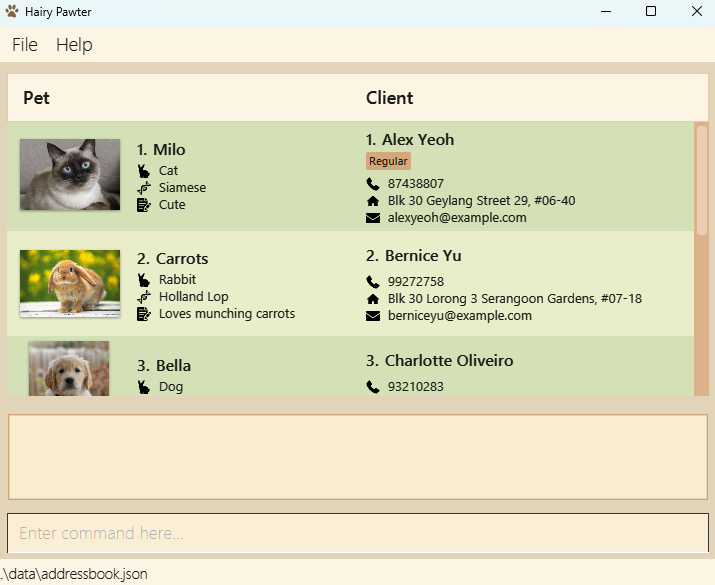

# Hairy Pawter User Guide

Hairy Pawter is a desktop app that helps you store details of clients and pets.
You can register clients and their pets, so that after grooming a pet, you can find the details of the owner and contact them.

<!-- * Table of Contents -->
<page-nav-print />

--------------------------------------------------------------------------------------------------------------------

## Installation

1. [Install](https://se-education.org/guides/tutorials/javaInstallation.html) Java `17` or higher to your computer.

1. Click on `tp.jar` to download it from [here](https://github.com/AY2526S2-CS2103T-F14-2/tp/releases).

1. Move `tp.jar` to the folder you want to use as the _home folder_ for this app.

1. Open a command terminal (Command Prompt for Windows, Terminal for Mac)

1. In the command terminal, enter the command `cd PATH` where PATH is the location of _home folder_ (e.g. `cd C:\Users\jeff\Desktop\HairyPawter\`)

1. In the command terminal, enter the command `java -jar tp.jar` to start the app. 

--------------------------------------------------------------------------------------------------------------------

## Commands

In the app, type a command in the command box and press Enter to execute it. (e.g. typing **`help`** and pressing Enter will open the help window) 

<box type="info" seamless>

**Reading the command guide:** 

* Words in `UPPER_CASE` should be replaced with real values. 
  e.g. `client n/NAME` should be used as `client n/John Doe`.

* Items in square brackets are optional. 
  e.g `[t/TAG]` can be ignored.

* Items with `…`​ can be used multiple times. 
  e.g. `[t/TAG]…​` can be used as `t/friend t/family`

* Inputs can be in any order. 
  e.g. if the command specifies `n/NAME p/PHONE_NUMBER`, `p/PHONE_NUMBER n/NAME` is also acceptable.

* If you are using a PDF version of this document, be careful when copying and pasting commands that span multiple lines as space characters surrounding line-breaks may be omitted when copied over to the application.
</box>

### Viewing help : `help`

Shows a message explaining how to access the help page.

Format: `help`

### Adding a client: `addClient`

Registers a new client. The new client will be shown on the list.

<box type="tip" seamless>

**Important:** Clients can have the same name, but never the same phone number
</box>

Format: `addClient n/NAME p/PHONE_NUMBER e/EMAIL a/ADDRESS [t/TAG]…​`

Examples:
* `addClient n/John Doe p/98765432 e/johnd@example.com a/John street, block 123, #01-01`
* `addClient n/Betsy Crowe t/friend e/betsycrowe@example.com a/Crown street p/1234567`

### Adding a pet: `addPet`

Registers a new pet of a client. The name of the pet and the **phone number of the client** are needed.

Format: `addPet n/NAME p/PHONE_NUMBER​ [s/SPECIES] [b/BREED]`

Examples:
* `addPet n/Snowy p/0000 s/Dog b/Wire Fox Terrier (White)`
* `addPet n/Meowy p/123456`

### Listing all clients and pets : `list`

Shows all clients and pets.

Format: `list`

### Editing a client : `editClient`

Edits an existing client.

* Edits the client at the specified `POSITION`. The `POSITION` refers to the number shown next to the client.​
* Specified values will override old values.
* Editing tags will clear previous tags
* You can remove a client’s tags by typing `t/` without
    specifying any tags after it.

Format: `editClient POSITION [n/NAME] [p/PHONE] [e/EMAIL] [a/ADDRESS] [t/TAG]…​`

Examples:
*  `editClient 1 p/91234567 e/johndoe@example.com` Edits the details of the client in `POSITION` 1.
*  `editClient 2 n/Betsy Crower t/` Changes the name of the client in `POSITION` 2 to `Betsy Crower` and clears their tags.

### Editing a pet : `editPet`

Edits an existing pet.

* Edits the pet at the specified `POSITION`. The `POSITION` refers to the number shown next to the pet.​
* Specified values will override old values.

Format: `editPet POSITION [n/NAME] [s/SPECIES] [b/BREED]​`

Examples:
*  `editPet 1 s/cat` Edits the species of the pet in `POSITION` 1.
*  `editPet 2 n/Gunner` Changes the name of the pet in `POSITION` 2 to `Gunner`

### Locating clients by name: `find`

Finds pets and clients who match **all** of the given keywords.

* The match is partial and case-insensitive. e.g `Roy` will match `Leroy`
* The order of the keywords does not matter. e.g. `Hans Bo` will match `Bo Hans`

Format: `find KEYWORD...`

Examples:
* `findClient John` returns `john` and `John Doe`
* `findClient alex david` returns `Alex Yeoh`, `David Li` 
  

### Deleting a client : `deleteClient`

Deletes the specified client.

* Deletes the client at the specified `POSITION`.
* The `POSITION` refers to the `POSITION` number shown in the displayed client list.​

Format: `deleteClient POSITION`

Examples:
* `list` followed by `delete 2` deletes the client with `POSITION` 2 in the displayed list.
* `findClient Betsy` followed by `delete 1` deletes the 1st client in the results of the `findClient` command.

### Deleting a pet : `deletePet`

Deletes the pet with the specified name, belonging to the **owner with the phone number**.

Format: `deletePet n/NAME p/PHONE_NUMBER`

Examples:
* `deletePet n/Snowy p/0000`
* `deletePet n/Meowy p/123456`

### Clearing all records : `clear`

Clears all records from memory.

Format: `clear`

### Exiting the app : `exit`

Exits the app.

Format: `exit`

### Saving the data

Data is saved automatically. There is no need to save manually.

### Editing the data file

Data is saved automatically as a JSON file `[tp.jar file location]/data/addressbook.json`. Advanced users are welcome to update data directly by editing that data file.

<box type="warning" seamless>

**Caution:**
If your changes to the data file makes its format invalid, the entire file will be discarded the next time the app is opened.  Hence, it is recommended to take a backup of the file before editing it. 
Furthermore, certain edits can cause the app to behave in unexpected ways (e.g., if a value entered is outside the acceptable range). Therefore, edit the data file only if you are confident that you can update it correctly.
</box>

### Archiving data files `[coming in v2.0]`

_Details coming soon ..._

--------------------------------------------------------------------------------------------------------------------

## FAQ

**Q**: How do I transfer my data to another Computer? 
**A**: Install the app in the other computer and overwrite the empty data file it creates with the file that contains the data of your previous AddressBook home folder.

--------------------------------------------------------------------------------------------------------------------

## Known issues

1. **When using multiple screens**, if you move the application to a secondary screen, and later switch to using only the primary screen, the GUI will open off-screen. The remedy is to delete the `preferences.json` file created by the application before running the application again.
2. **If you minimize the Help Window** and then run the `help` command (or use the `Help` menu, or the keyboard shortcut `F1`) again, the original Help Window will remain minimized, and no new Help Window will appear. The remedy is to manually restore the minimized Help Window.

--------------------------------------------------------------------------------------------------------------------

## Command summary

Action     | Format, Examples
-----------|----------------------------------------------------------------------------------------------------------------------------------------------------------------------
**AddClient** | `addClient n/NAME p/PHONE_NUMBER e/EMAIL a/ADDRESS [t/TAG]…​`   e.g., `addClient n/James Ho p/22224444 e/jamesho@example.com a/123, Clementi Rd, 1234665 t/friend`
**AddPet** | `addPet n/NAME p/PHONE_NUMBER​`   e.g., `addPet n/Meowy p/22224444`
**Clear**  | `clear`
**DeleteClient** | `deleteClient POSITION`  e.g., `deleteClient 3`
**DeletePet** | `deletePet n/NAME p/PHONE_NUMBER`  e.g., `deletePet n/Meowy p/22224444`
**EditClient**   | `editClient POSITION [n/NAME] [p/PHONE_NUMBER] [e/EMAIL] [a/ADDRESS] [t/TAG]…​`  e.g.,`editClient 2 n/James Lee e/jameslee@example.com`
**EditPet**   | `editPet POSITION [n/NAME] [s/SPECIES] [b/BREED]` 
e.g.,`editPet 2 n/Pongo`
**Exit**   | `exit`
**Find**   | `find KEYWORD...`  e.g., `find James dog`
**Help**   | `help`
**List**   | `list`

