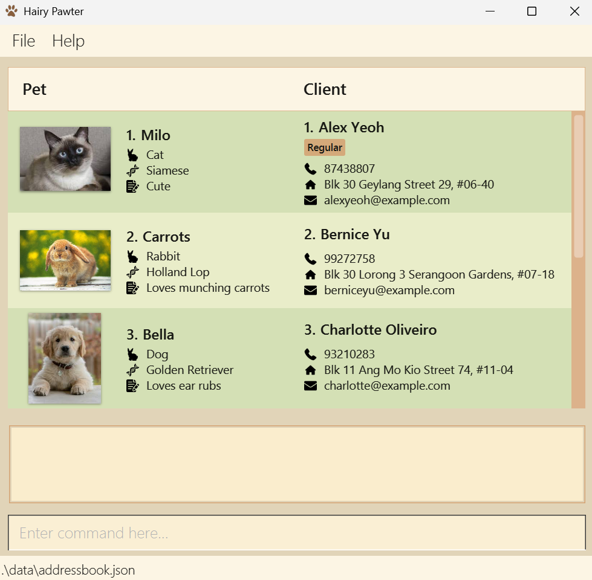
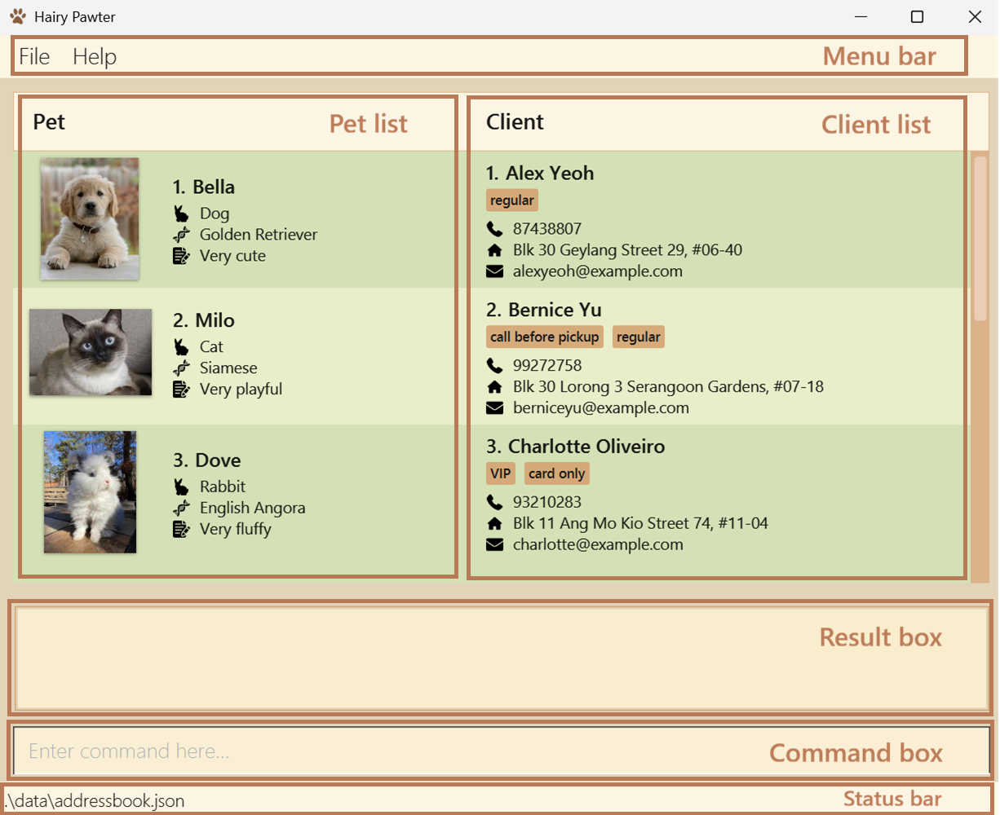
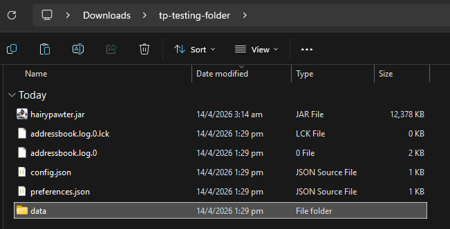
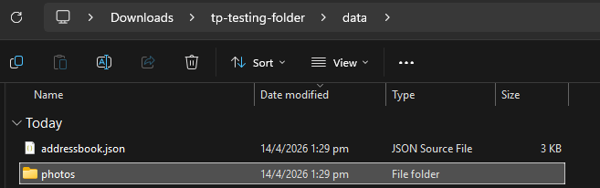
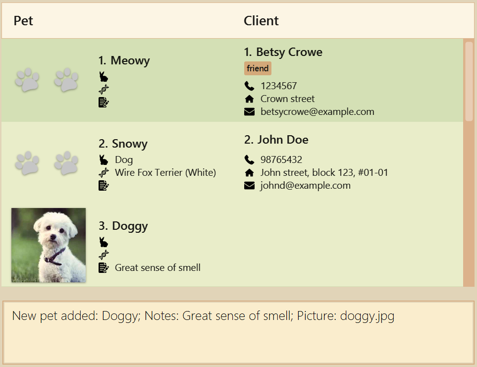
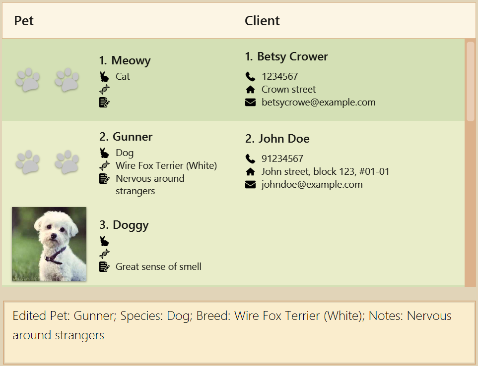
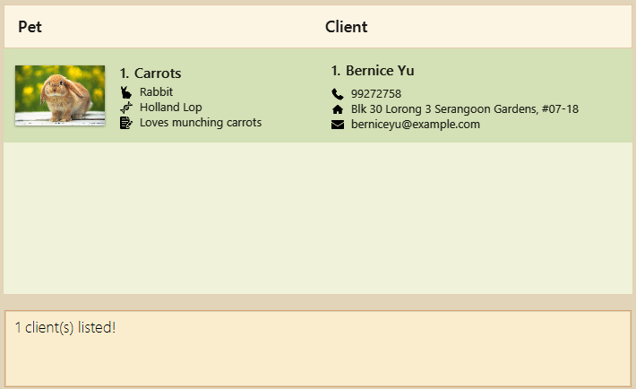
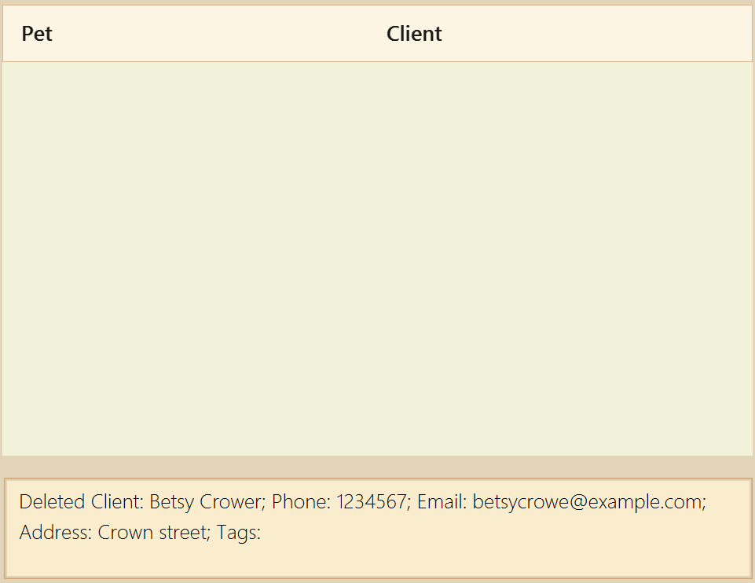
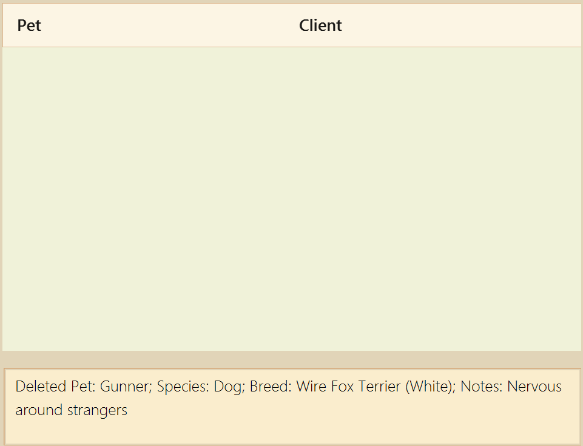

# Hairy Pawter User Guide

Hairy Pawter is a desktop app designed specifically for **pet groomers** to effortlessly manage client and pet records. By centralizing your data, Hairy Pawter helps you save time, personalize your business information and streamline client communication.

Use it to:
- **Save time** by quickly recording the contact details and pets of clients when they walk in
- **Store detailed information** by tracking each pet's species, breed, notes, and photos for easy identification
- **Streamline communication** by quickly finding a client's contact details after finishing a grooming session
- **Centralize records** to manage both walk-in and appointment clients in one place

<!-- * Table of Contents -->
<page-nav-print />

--------------------------------------------------------------------------------------------------------------------

## Who is this guide for?

This guide is written for **pet groomers** who manage their own client base.

**No programming or technical experience is needed.** We assume you have basic computer skills and are comfortable typing short commands into a text field, as Hairy Pawter is a keyboard-first app, designed for speed.

If you are setting up Hairy Pawter for the first time, start with the [Quick Start](#quick-start) section below.

--------------------------------------------------------------------------------------------------------------------

<div style="page-break-after: always;"></div>

## Quick Start

### Installation

1. [Install](https://se-education.org/guides/tutorials/javaInstallation.html) `Java 17` or higher on your computer.

   * `Java 17` is a reputable, widely-used software that allows Hairy Pawter to run smoothly across Windows, Mac, and Linux systems.
<br><br>

1. Download `hairypawter.jar` from the latest release [here](https://github.com/AY2526S2-CS2103T-F14-2/tp/releases).

   * It will appear in your Downloads folder.
<br><br>

1. Move `hairypawter.jar` to the folder you want to use as the _home folder_ for Hairy Pawter.

   * You can create a new folder called `HairyPawter` within your Desktop folder, and move `hairypawter.jar` inside the new folder.
<br><br>

1. Double-click `hairypawter.jar` to run Hairy Pawter.

<box type="info" seamless>

**If double-clicking does not open the app:**

Open a command terminal (a program that lets you type text commands to your computer):
* **Windows:** Search for `Command Prompt` in the taskbar search.
* **Mac:** Press `Cmd` + `Space` and search for `Terminal`.
* **Linux:** Try `Ctrl` + `Alt` + `T`.

In the terminal, navigate to your home folder using `cd PATH_TO_HOME_FOLDER`.<br>
e.g. `cd C:\Users\jeff\Desktop\HairyPawter\`

Then run: `java -jar hairypawter.jar`

You can ignore any other text output in the terminal while the app is running. Note that closing the terminal will also close the app.

The below sample data will be populated on startup.



</box>

### App layout



When Hairy Pawter opens, you will see the following areas:

 * **Menu bar** (Top of the window)
   - Dropdown options to view the help window or exit the application
 * **Client list** (Right panel)
   - Displays all clients and their contact details
 * **Pet list** (Left panel)
   - Displays the pets belonging to each client
 * **Result box** (Below both lists)
   - Shows the outcome of your last command
 * **Command box** (Below the result box)
   - Type your commands here and press Enter
 * **Status bar** (Bottom of the window)
    - Displays the location of the data file

### Try it yourself: a first session

Follow these steps to get started. Type each command into the command box and press Enter.

1. `addClient n/John Tan p/91234567 e/john@email.com`<br>
   Adds a client named John Tan with phone number 91234567.

2. `addPet n/Biscuit p/91234567 s/Dog b/Golden Retriever nt/Loves belly rubs`<br>
   Adds a dog named Biscuit owned by John Tan (determined by phone number of owner).

3. `find Biscuit`<br>
   Filters the list to show only records matching "Biscuit".

4. `list`<br>
   Returns to the full list of all clients and pets.

5. `deleteClient 1`<br>
   Deletes the client at position 1 and all their pets.

--------------------------------------------------------------------------------------------------------------------

## Commands

You can type a command into the command box and press Enter to run it. For example, typing `help` and pressing Enter opens the help window.

<box type="info" seamless>

**Reading the command format:**<br>

* Words in `UPPER_CASE` are placeholders — replace them with real values.<br>
  e.g. `addClient n/NAME` should be typed as `addClient n/John Doe`.

* Items in square brackets are optional.<br>
  e.g. `[t/TAG]` can be left out entirely.

* Items with `…` can be repeated multiple times.<br>
  e.g. `[t/TAG]…` can be typed as `t/regular t/card only`.

* Items can be in any order.<br>
  e.g. if the format shows `n/NAME p/PHONE`, typing `p/PHONE n/NAME` also works.

* **`POSITION`** refers to the number displayed next to a client or pet in the list. It changes whenever you use `find` or `list`, so always look at the number of clients and pets currently shown, before editing or deleting.

* If you are using a PDF version of this document, be careful when copying and pasting commands that span multiple lines, as space characters around line-breaks may be dropped.
</box>

<box type="tip" seamless>

**Tip:** Most commands have a short-form alias for faster typing. See the [Short-form commands](#short-form-commands) section.

</box>

### Viewing help : `help`

You would use the `help` command when you don't remember the command to perform a specific action.

This command brings up a link to the user guide (this document), so you can refer to the list of commands and how to use them.


Format: `help`

**Expected output:**
```
Opened help window.
```

<br><br>

### Adding a client: `addClient`

You can use this command to register a new client. You can add optional details, or let them default to `-`. New clients appear at the top of the list to facilitate adding pets.

If you have more details to add, you can save them as `[t/TAG]`s. You can also use `[t/TAG]` to store the date a client visits, so that you can find clients who visited on a certain day.

<box type="warning" seamless>

**Constraints:**
* Each client must have a unique phone number. You cannot add two clients with the same phone number.
* There are no constraints placed on the phone field, so that you can add the client's preferred contact should they not have a phone number.

</box>

Format: `addClient p/PHONE [n/NAME] [e/EMAIL] [a/ADDRESS] [t/TAG]…`

Examples:
* `addClient n/John Doe p/98765432 e/johnd@example.com a/John street, block 123, #01-01` — adds a client John Doe with all fields and no tag.
* `addClient n/Betsy Crowe t/friend e/betsycrowe@example.com a/Crown street p/1234567` — adds a client Betsy Crowe with all fields and a tag.

**Expected output:**
```
New client added: John Doe; Phone: 98765432; Email: johnd@example.com; Address: John street, block 123, #01-01; Tags:
```
```
New client added: Betsy Crowe; Phone: 1234567; Email: betsycrowe@example.com; Address: Crown street; Tags: friend
```

<box type="info" seamless>

**Note:** If you have used `find` and the new client does not match your keywords, they will not appear in the current view. Type `list` to see all clients.

</box>

<br><br>

### Adding a pet: `addPet`

You can use this command to register a new pet under an existing client. The pet is linked to the client using the client's phone number. Optional details will appear empty until you fill them in.

<box type="warning" seamless>

**Constraints:**
* The client must already be registered in Hairy Pawter before you can add their pet. Use [`addClient`](#adding-a-client-addclient) first.
* A client cannot have two pets with the same name.

</box>

Format: `addPet n/NAME p/PHONE [s/SPECIES] [b/BREED] [nt/NOTES] [pic/PICTURE]`

Examples:
* `addPet n/Snowy p/98765432 s/Dog b/Wire Fox Terrier (White)` — adds a dog Snowy owned by John Doe with the given breed.
* `addPet n/Meowy p/1234567` — adds a pet Meowy owned by Betsy Crowe.

**Expected output:**
```
New pet added: Snowy; Species: Dog; Breed: Wire Fox Terrier (White)
```
```
New pet added: Meowy
```

<box type="info" seamless>

##### **How to use `[pic/PICTURE]`:**<br>

* Locate this folder `[_hairypawter.jar home folder_]/data/photos/`. (if it has not been generated yet, run any command that adds or deletes an entry first)
* Copy a photo you wish to add into that folder, and take note of its filename.
* To add this photo, include its filename after `pic/`. (eg. `pic/doggy.jpg`)
* You may choose to organize the images within your `data/photos/` folder into subfolders. In this case, take note that you have to include the subfolder name in your input. (eg. `pic/[subfolder name]/[image filename]`).
   * Be careful not to end the subfolder name with a command item. (eg. `pic/subfolder nt/pet.jpg` is not allowed)
* If the photo does not appear, try using the `editPet` command to update the filename and filepath.

Example on Windows OS: Navigate to the `/data/photos/` subfolder as follows



Navigating to the `/data/photos/` subfolder can be done in a similar fashion for other OSes.

</box>

<box type="info" seamless>

##### **Using `[nt/NOTES]` to your advantage:**<br>

* `[nt/NOTES]` exists to record down important information about the pet. This can be identifying information
like leash colour, or allergies and quirks of the pet. Use this flexibly!

</box>

Additional example:

Set up:
- Download Doggy's picture as `doggy.jpg` from this [link](https://postimg.cc/VrvMrDpG).
- Navigate to the `/data/photos/` subfolder
- Place `doggy.jpg` inside this subfolder

Command:
* `addPet n/Doggy p/98765432 nt/Great sense of smell pic/doggy.jpg` — adds a pet Doggy owned by John Doe with the given grooming notes and a picture.

**Expected output:**
```
New pet added: Doggy; Notes: Great sense of smell; Picture: doggy.jpg
```

Screenshot:


<br><br>

### Editing a client : `editClient`

Use this command to edit the details of an existing client.

* Edits the client at the specified `POSITION`.
* Only the fields you provide will be updated; all other fields remain unchanged.
* Editing tags replaces all existing tags. To remove all tags, use `t/` with no value.

Format: `editClient POSITION [n/NAME] [p/PHONE] [e/EMAIL] [a/ADDRESS] [t/TAG]…`

At least one field (`n/`, `p/`, `e/`, `a/`, or `t/`) must be provided.

Examples:
* `editClient 2 p/91234567 e/johndoe@example.com` — updates the phone and email of the client at position 2.
* `editClient 1 n/Betsy Crower t/` — renames the client at position 1 and removes all their tags.

**Expected output:**
```
Edited Client: John Doe; Phone: 91234567; Email: johndoe@example.com; Address: John street, block 123, #01-01; Tags:
```
```
Edited Client: Betsy Crower; Phone: 1234567; Email: betsycrowe@example.com; Address: Crown street; Tags:
```

<box type="info" seamless>

**Notes:**
* Changing a client’s phone number does not affect their pets — the pets remain associated with that client under the new phone number.
* Changing a client's phone number to another client's phone number is not allowed, since clients are identified by their phone number.
* Attempting to modify a client's details to the exact details they had before will return a success as long as the input values are valid.

</box>

<br><br>

### Editing a pet : `editPet`

Use this command to edit the details of an existing pet.

* Edits the pet at the specified `POSITION`.
* Only the fields you provide will be updated; all other fields remain unchanged.
* To remove the value for any optional fields (Species, Breed, Note, Picture), simply include the corresponding tag with no value.
* A pet's owner cannot be changed with `editPet`. To reassign a pet to a different owner, delete the pet with [`deletePet`](#deleting-a-pet-deletepet) and re-add it with [`addPet`](#adding-a-pet-addpet).

Format: `editPet POSITION [n/NAME] [s/SPECIES] [b/BREED]​ [nt/NOTES] [pic/PICTURE]`

At least one field must be provided.

Examples:
* `editPet 1 s/Cat` — updates the species of the pet at position 1.
* `editPet 2 n/Gunner nt/Nervous around strangers` — renames the pet at position 2 and updates their notes.

**Expected output:**
```
Edited Pet: Meowy; Species: Cat
```
```
Edited Pet: Gunner; Species: Dog; Breed: Wire Fox Terrier (White); Notes: Nervous around strangers
```

Screenshot:


<box type="info" seamless>

**Note:** Attempting to modify a pet's details to the exact details they had before will return a success as long as the input values are valid.

</box>

<br><br>

### Locating clients and pets by keywords: `find`

Use this command to filter only clients and pets that match **all** of the given keywords.

* The filter covers all fields except `[pic/PICTURE]`: client name, phone, email, address, tags, and pet name, species, breed, and notes.
* Matching is partial and case-insensitive (e.g. `Roy` matches `Leroy`).
* All keywords must match — e.g. `Hans Bo` only shows results where both `Hans` and `Bo` appear somewhere in the record.
* Keyword order does not matter.
* This filter stays active until you run `list`.

Format: `find KEYWORD…`

Examples:
* `find Yu` — shows clients with `Yu` in their details or their pets' details.
* `find Yu cat` — shows clients where both `Yu` and `cat` appear anywhere across the client's or their pets' details.

**Expected output:**

```
0 client(s) listed!
```

<box type="info" seamless>

**Notes:**
* The result count shows the number of **clients** matched, not pets.
* The `find` command will show **all** the pets of each matched client.

</box>

<br><br>

### Listing all clients and pets : `list`

Use this command to show all clients and their pets.

Format: `list`

**Expected output:**
```
Listed all clients
```

<br><br>

### Deleting a client : `deleteClient`

Use this command to delete a client.

<box type="info" seamless>

**Warning:** Deleting a client also permanently deletes all of their pets. This cannot be undone.

</box>

Format: `deleteClient POSITION`

Examples:
* `list` followed by `deleteClient 3` — deletes the client at position 3 in the full list.
* `find Betsy` followed by `deleteClient 1` — deletes the first client in the filtered results.

**Expected output:**
```
Deleted Client: Alex Yeoh; Phone: 87438807; Email: alexyeoh@example.com; Address: Blk 30 Geylang Street 29, #06-40; Tags: [Regular]
```
```
Deleted Client: Betsy Crower; Phone: 1234567; Email: betsycrowe@example.com; Address: Crown street; Tags:
```

Screenshot:


**Note:**
* After using `deleteClient` on a filtered list (after the `find` command), remember to run the `list` command again to view all clients and pets.


<br><br>

### Deleting a pet : `deletePet`

Use this command to delete a pet.

Format: `deletePet POSITION`

<box type="info" seamless>

**Note:** Pet positions are numbered sequentially across all clients in the list, not per client. For example, if client 1 has 2 pets and client 2 has 1 pet, the pets are at positions 1, 2, and 3 respectively. Always check the current position number before deleting.

Unlike `addPet` (which identifies the owner by phone number), `deletePet` uses the pet's position number shown in the list.

</box>

Examples:
* `list` followed by `deletePet 2` — deletes the pet at position 2 in the full list.
* `find Gunner` followed by `deletePet 1` — deletes the first pet in the filtered results.

**Expected output:**
```
Deleted Pet: Doggy; Notes: Great sense of smell; Picture: doggy.jpg
```
```
Deleted Pet: Gunner; Species: Dog; Breed: Wire Fox Terrier (White); Notes: Nervous around strangers
```

Screenshot:


**Note:**
* After using `deletePet` on a filtered list (after the `find` command), remember to run the `list` command again to view all clients and pets.

<br><br>

### Clearing all records : `clear`

Use this command to delete all clients and pets from Hairy Pawter.

<box type="warning" seamless>

**Warning:** This permanently deletes every client and pet record. This cannot be undone. Consider [backing up your data file](#editing-the-data-file) before using this command.

</box>

Format: `clear`

**Expected output:**
```
Hairy Pawter has been cleared!
```

<br><br>

### Exiting the app : `exit`

Use this command to exit the app.

Format: `exit`

<br><br>
--------------------------------------------------------------------------------------------------------------------

## Storing data

Data is saved automatically after every command. There is no need to save manually.

<br><br>

### Editing the data file

Data is stored as a JSON file at `[_hairypawter.jar home folder_]/data/addressbook.json`. You can edit this file directly if needed, but this is not recommended.

<box type="warning" seamless>

**Caution:** If your edits make the file format invalid, the entire file will be discarded the next time the app opens. Back up the file before editing it.

Certain edits may also cause the app to behave unexpectedly (e.g. if a value is outside the accepted range). Only edit the data file if you are confident you can update it correctly.

Optional fields should still be included in the JSON with their corresponding default values (`-` for client and blank string for pet) to avoid unexpected behaviour.

</box>

<br><br>

--------------------------------------------------------------------------------------------------------------------

## FAQ

**Q**: Is it safe to click the close button instead of typing `exit`?<br>
**A**: Yes. Your data is saved automatically, so closing the window normally will not result in data loss.


**Q**: What should I do if a client does not have a phone number?<br>
**A**: You can enter their preferred contact method (e.g. email address or messaging handle) in the `p/PHONE` field instead.


**Q**: How do I reorder my clients?<br>
**A**: Reordering is not currently supported. As a workaround, close the app and manually reorder the client entries in the data file at `[_hairypawter.jar home folder_]/data/addressbook.json`.


**Q**: I was trying out commands on the sample data and accidentally ran the `clear` command. Is it possible to retrieve the sample data again, so that I can continue trying out the commands?<br>
**A**: Yes. You can retrieve the sample data by following these steps:
1. On your computer, locate the `data/` folder inside your Hairy Pawter home folder.
1. Ensure you have a copy of the `addressbook.json` file stored outside the Hairy Pawter home folder, as a backup.
1. Delete the `addressbook.json` file present in the `data/` folder.
1. Run Hairy Pawter again and the sample data will be populated on startup.


**Q**: How do I transfer my data to another computer?<br>
**A**: Follow these steps to smoothly transfer your data:
1. On your current computer, locate the `data/` folder inside your Hairy Pawter home folder.
1. Copy this entire `data/` folder to a portable USB drive or cloud storage.
1. On your new computer, set up Hairy Pawter by following the [Quick Start](#quick-start) guide.
1. Paste the copied `data/` folder into the new home folder, replacing the existing one.

**Q**: How do I clear a client's name, email or address?<br>
**A**: You can edit it to `-`, which is the standard default for client details.

--------------------------------------------------------------------------------------------------------------------

## Known issues

1. **When using multiple screens**, if you move the app to a secondary screen and later return to using only the primary screen, the window may open off-screen.
   * **Fix:** Delete the `preferences.json` file in your home folder before restarting the app.
2. **If you minimize the Help Window** and then run the `help` command again (or press `F1`), the existing minimized window will not reappear and no new window will open.
   * **Fix:** Manually restore the minimized Help Window from your taskbar.
3. **If you utilize any invalid non-standard Unicode characters**, such as the `U+200B` zero-width space, the input will be accepted and displayed as a blank character.
   * **Fix:** Utilize a standard-width space character for behaviour to fall within expected boundaries.
4. **Using a photo that is too large** may cause it to fail to be displayed.
   * **Fix:** Utilize an image of smaller resolution instead.

--------------------------------------------------------------------------------------------------------------------

<div style="page-break-after: always;"></div>

## Command summary

Action | Format, Examples
-------|----------------------------------------------------------------------------------------------------------------------------------------------------------------------
**[addClient](#adding-a-client-addclient)** | `addClient p/PHONE [n/NAME] [e/EMAIL] [a/ADDRESS] [t/TAG]…​` <br> e.g. `addClient n/James Ho p/22224444 e/jamesho@example.com a/123, Clementi Rd, 1234665 t/friend`
**[addPet](#adding-a-pet-addpet)** | `addPet n/NAME p/PHONE​ [s/SPECIES] [b/BREED] [nt/NOTES] [pic/PICTURE]` <br> e.g. `addPet n/Meowy p/22224444`
**[clear](#clearing-all-records-clear)** | `clear`
**[deleteClient](#deleting-a-client-deleteclient)** | `deleteClient POSITION`<br> e.g. `deleteClient 3`
**[deletePet](#deleting-a-pet-deletepet)** | `deletePet POSITION`<br> e.g. `deletePet 1`
**[editClient](#editing-a-client-editclient)** | `editClient POSITION [n/NAME] [p/PHONE] [e/EMAIL] [a/ADDRESS] [t/TAG]…​`<br> e.g. `editClient 2 n/James Lee e/jameslee@example.com`
**[editPet](#editing-a-pet-editpet)** | `editPet POSITION [n/NAME] [s/SPECIES] [b/BREED] [nt/NOTES] [pic/PICTURE]`<br> e.g. `editPet 2 n/Pongo`
**[exit](#exiting-the-app-exit)** | `exit`
**[find](#locating-clients-and-pets-by-keywords-find)** | `find KEYWORD…`<br> e.g. `find James dog`
**[help](#viewing-help-help)** | `help`
**[list](#listing-all-clients-and-pets-list)** | `list`


## Short-form commands

For faster typing, Hairy Pawter supports short-form aliases for the most common commands. Short-forms accept the same parameters as their full equivalents.

| Action | Short-form | Example |
|--------|------------|---------|
| `addClient` | `ac` | `ac n/John Doe p/98765432` |
| `addPet` | `ap` | `ap n/Meowy p/98765432` |
| `deleteClient` | `dc` | `dc 1` |
| `deletePet` | `dp` | `dp 2` |
| `editClient` | `ec` | `ec 1 n/Jane Doe` |
| `editPet` | `ep` | `ep 1 s/Cat` |
